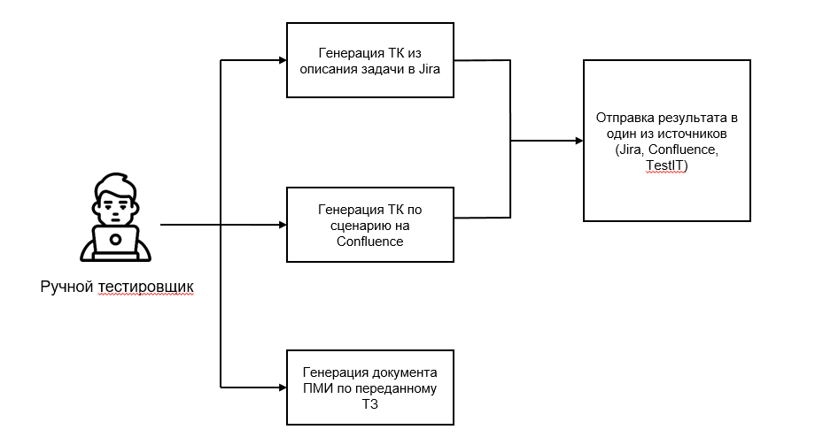
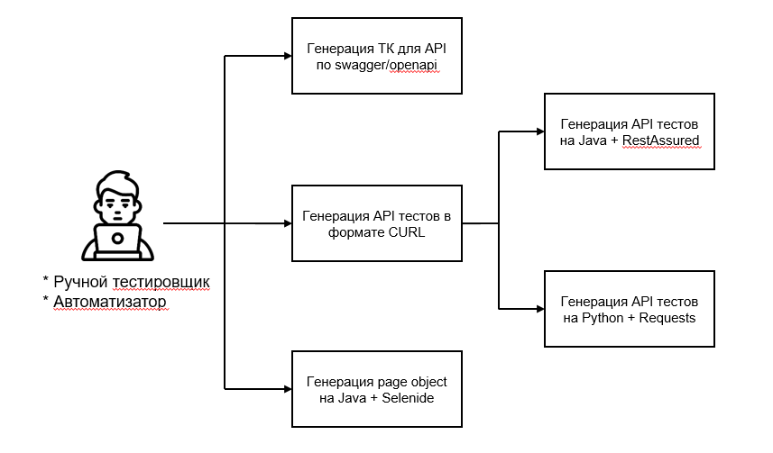

# gpt-bot
Проект для QA специалистов, ассистент может помочь с генерацией тестовых кейсов по спецификации на Сonfluence, либо по описанию тикета в Jira, также при генерации API тестов, Page Object для UI автотестов.

Основные функции ассистента:

- **/getcasejira** - генерация тестового кейса в Jira по переданному идентификатору сущности.
- **/getcasewiki** - генерация тестового кейса по сценарию на вики по переданному id страницы.
- **/getcaseapi** - генерация тестового кейса по swagger и нужному методу.
- **/createPageObject** - генерация описания объектов html страницы для АТ по переданным данным.
- **/clearSession** - очистка пользовательской сессии.
- **/createBugReport** - создание баг-репорта в Jira.

## Getting started
1) Готовый докер образ можно скачать так: "docker pull deniskirov/qa-gpt-bot:latest". 

Либо можно кастомизировать ассистента под себя и собрать свою версию.
```bash
cd {project_folder}
docker build -t {image_name} .
```
2) Необходимо заполнить конфигурационный файл [config.yaml](https://github.com/domrf-tech-qa/gpt-bot/blob/main/config.yaml) своими параметрами.

3) Для запуска можно использовать следующий bash скрипт: 
```bash
#!/bin/bash
docker run --privileged -e DIRECTORY='/tmp/test' -v {path_to_yaml}:/code/config.yaml {image_name}
```
4) С пользовательской инструкцией можно ознакомиться [тут](https://github.com/domrf-tech-qa/gpt-bot/wiki/Пользовательская-инструкция)

## Заполнение конфигурационного файла config.yaml

1) **bot_id:** '' # Идентификатор вашего бота

*Для того, чтобы зарегистрировать бота и получить его идентификатор, рекомендуем воспользоваться https://t.me/BotFather. [Гайд](https://botcreators.ru/blog/botfather-instrukciya/) по работе с ним.*

2) **log_path:** '' # Путь до лог файла

*Пример: 'mytestpath.log' - будет создан лог файл внутри контейнера, его можно "примониторовать" в корневую систему, либо посмотреть внутри контейнера через docker exec*

3) **gigachat_auth:** 'Basic {token}' #Токен базовой авторизации в sber gigachat

*Данные, для заполнения параметра {token} можно получить тут, после регистрации https://developers.sber.ru/studio/workspaces/{uuid}/gigachat-api/projects/{uuid}/settings*

4) yagpt_oauth: '' # токен авторизации в yandex gpt

5) yandexPassportOauthToken: '' # токен авторизации в yandex gpt (аналогичный предыдущему)
  
6) folder_id: '' # folder id в личном кабинете yandexgpt
  
7) yandexgpt_key: '' # Ключ yandexgpt

*Данные для заполнения данных параметров можно получить после регистрации аккаунта https://console.yandex.cloud/*

8) jira_link: '' # Ссылка на вашу Jira

*Пример https://jira.domain.ru/*

9) wiki_url: '' # Ссылка на ваш confluence

*Пример https://wiki.domain.ru*
  
 10) testit_url: '' #Ссылка на ваш TestIT

*Пример https://testit.domain.ru*

11) Адреса вашей БД PostgreSQL

*Пример pg_host: '127.0.0.1';
  pg_port: '5432';
  pg_database: 'postgres';
  pg_user: 'postgres';
  pg_password: 'postgres'*

  Также можно кастомизировать и настраивать под себя все сообщения, возвращаемые ботом, для этого можно отредактировать блок - **"bot_messages:"**

## Как работает ассистент

**Основные функции, доступные при работе с ассистентом:**



**Схема решения:**

.jpg)
